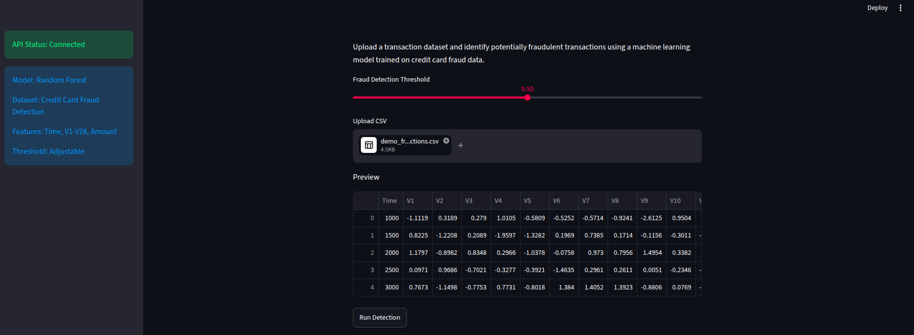
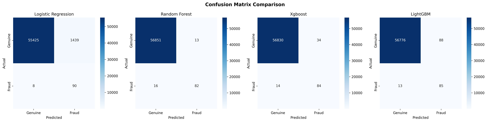
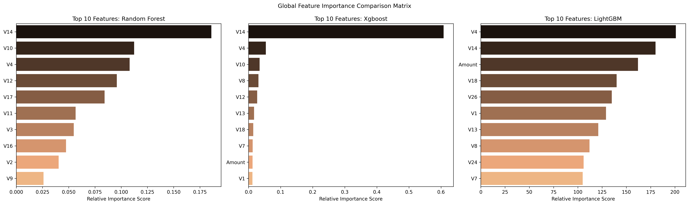
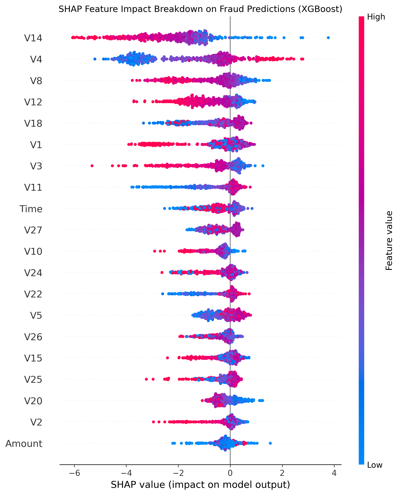
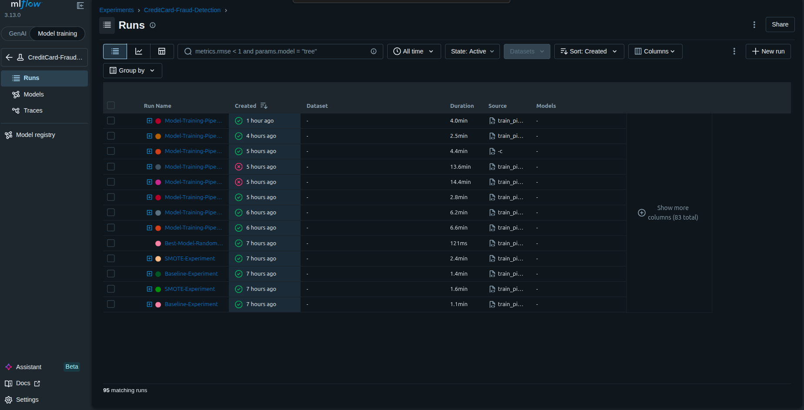
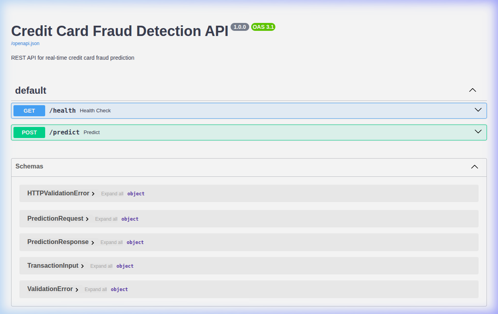

# 🔍 Credit Card Fraud Detection System


A production-style machine learning system for detecting fraudulent credit card transactions using **Random Forest**, **MLflow**, **FastAPI**, and **Streamlit**.

Built as an end-to-end ML pipeline — from raw data ingestion to a deployed prediction API with an interactive fraud operations dashboard.



---

## 📋 Overview

##  Key Results

- Built an end-to-end fraud detection system using Random Forest, FastAPI, MLflow, and Streamlit.
- Evaluated 4 machine learning models under baseline and SMOTE-based training strategies.
- Achieved an AUPRC of 0.87 on a highly imbalanced fraud detection dataset.
- Implemented experiment tracking with MLflow and SQLite backend.
- Developed a REST API for batch fraud prediction.
- Created a Streamlit fraud operations dashboard for analyst workflows.
This project detects fraudulent credit card transactions using supervised machine learning on highly imbalanced data.

The system includes:

- **Data Ingestion** — Auto-download from Kaggle or local CSV
- **Data Transformation** — RobustScaler + SMOTE oversampling
- **Model Training** — 4 classifiers with baseline & SMOTE experiments
- **MLflow Experiment Tracking** — Parameters, metrics, visualizations, and artifacts
- **FastAPI Prediction Service** — REST API for real-time batch predictions
- **Streamlit Dashboard** — Interactive fraud operations UI with CSV upload and risk categorization
- **Serialized Artifacts** — Trained model, scaler, and metadata persisted for inference

---

## 🏗️ System Architecture

```
┌─────────────────────────────────────────────────────────┐
│                   Streamlit Dashboard                   │
│              (CSV Upload + Risk Analysis)               │
└──────────────────────┬──────────────────────────────────┘
                       │ HTTP POST /predict
                       ▼
┌─────────────────────────────────────────────────────────┐
│                     FastAPI Server                      │
│            (Request Validation + Routing)                │
└──────────────────────┬──────────────────────────────────┘
                       │
                       ▼
┌─────────────────────────────────────────────────────────┐
│                  Prediction Pipeline                    │
│         (Load Scaler → Scale → Predict → Threshold)     │
└──────────────────────┬──────────────────────────────────┘
                       │
                       ▼
┌─────────────────────────────────────────────────────────┐
│              Random Forest Model (model.pkl)            │
│                  + RobustScaler (scaler.pkl)             │
└──────────────────────┬──────────────────────────────────┘
                       │
                       ▼
              Fraud Predictions + Probabilities
```

---
## 🎥 Demo

### Dashboard Workflow

1. Upload a CSV file containing transaction records.
2. Select a fraud detection threshold.
3. Run fraud detection through the FastAPI backend.
4. Review flagged transactions and risk levels.
5. Download prediction results as CSV.

### Outputs

- Fraud Probability
- Risk Level (High / Medium / Low)
- Fraud Distribution
- High Risk Transactions
- Batch Prediction Results

## 📊 Dataset

| Property | Details |
|----------|---------|
| **Source** | [European Credit Card Fraud Detection](https://www.kaggle.com/datasets/mlg-ulb/creditcardfraud) |
| **Records** | 284,807 transactions |
| **Features** | `Time`, `V1`–`V28` (PCA-transformed), `Amount` |
| **Target** | `Class` — `0` = Genuine, `1` = Fraud |
| **Fraud Rate** | ~0.17% (highly imbalanced) |
| **Handling** | SMOTE oversampling on training set |

---

## 📁 Project Structure

```
.
├── app.py                          # FastAPI prediction server
├── streamlit_app.py                # Streamlit fraud operations dashboard
├── eda.ipynb                       # Exploratory data analysis notebook
├── mlflow.db                       # MLflow tracking database (SQLite)
├── requirements.txt                # Python dependencies
│
├── artifacts/
│   ├── metrics/
│   │   ├── model_metrics_baseline.csv
│   │   ├── model_metrics_smote.csv
│   │   ├── confusion_matrices.png
│   │   ├── global_feature_importance.png
│   │   └── shap_summary_xgboost.png
│   └── model/
│       ├── model.pkl               # Best trained model (Random Forest)
│       ├── scaler.pkl              # Fitted RobustScaler
│       └── metadata.json           # Best model metadata
│
├── src/
│   ├── __init__.py
│   ├── components/
│   │   ├── data_ingestion.py       # Data loading (Kaggle/local)
│   │   ├── data_transformation.py  # Scaling + SMOTE + train/test split
│   │   └── model_training.py       # Training, evaluation, MLflow logging
│   ├── pipeline/
│   │   ├── train_pipeline.py       # End-to-end training orchestrator
│   │   └── prediction_pipeline.py  # Inference pipeline (model + scaler)
│   └── utils/
│       ├── logger.py               # Logging configuration
│       └── save_object.py          # Pickle serialization helpers
│
├── data/
│   └── creditcard.csv              # Raw dataset (gitignored)
│
├── images/                         # Screenshots for documentation
│
└── logs/                           # Application logs (gitignored)
```

---

## ⚙️ ML Pipeline

The training pipeline (`train_pipeline.py`) orchestrates the following stages:

```
Data Ingestion (Kaggle / Local CSV)
        │
        ▼
Data Transformation
   ├── Train/Test Split (80/20, stratified)
   ├── RobustScaler on [Time, Amount]
   └── SMOTE Oversampling on training set
        │
        ▼
Model Training
   ├── Baseline Experiment (original data)
   └── SMOTE Experiment (resampled data)
        │
        ▼
Model Evaluation
   ├── Precision, Recall, F1, ROC-AUC, AUPRC
   ├── Confusion Matrices
   └── SHAP Explainability
        │
        ▼
Best Model Selection (by AUPRC)
        │
        ▼
Artifact Persistence
   ├── model.pkl + scaler.pkl
   ├── Evaluation plots (PNGs)
   └── MLflow artifact logging
```

---

## 🤖 Models Evaluated

All models were trained under two experimental settings:

| Model | Experiment | Precision | Recall | F1 Score | ROC-AUC | AUPRC |
|-------|-----------|-----------|--------|----------|---------|-------|
| **Random Forest** | **SMOTE** | **0.863** | **0.837** | **0.850** | **0.973** | **0.871** |
| Random Forest | Baseline | 0.941 | 0.816 | 0.874 | 0.963 | 0.873 |
| XGBoost | SMOTE | 0.712 | 0.857 | 0.778 | 0.983 | 0.865 |
| XGBoost | Baseline | 0.867 | 0.796 | 0.830 | 0.939 | 0.797 |
| Logistic Regression | SMOTE | 0.059 | 0.918 | 0.111 | 0.971 | 0.725 |
| Logistic Regression | Baseline | 0.829 | 0.643 | 0.724 | 0.957 | 0.739 |
| LightGBM | SMOTE | 0.491 | 0.867 | 0.627 | 0.944 | 0.775 |
| LightGBM | Baseline | 0.079 | 0.306 | 0.126 | 0.468 | 0.032 |

---

## 🏆 Best Model

The best model was selected based on **AUPRC** (Area Under Precision-Recall Curve) — the most appropriate metric for highly imbalanced fraud detection.

| Metric | Value |
|--------|-------|
| **Model** | Random Forest |
| **Experiment** | SMOTE |
| **Precision** | 0.863 |
| **Recall** | 0.837 |
| **F1 Score** | 0.850 |
| **ROC-AUC** | 0.973 |
| **AUPRC** | 0.871 |

### Confusion Matrix



### Feature Importance



### SHAP Explainability (XGBoost)



---

## 📈 MLflow Tracking

All experiments are tracked with **MLflow** using a local SQLite backend.

**Features tracked per run:**

- Hyperparameters (all `model.get_params()`)
- Metrics — Precision, Recall, F1, ROC-AUC, AUPRC
- Confusion Matrix visualizations
- Feature Importance plots
- SHAP summary plots
- Serialized model artifacts (`.pkl`)

**Experiment structure:**

```
CreditCard-Fraud-Detection (Experiment)
└── Model-Training-Pipeline (Parent Run)
    ├── Baseline-Experiment (Nested Run)
    │   ├── Logistic Regression
    │   ├── Random Forest
    │   ├── XGBoost
    │   └── LightGBM
    └── SMOTE-Experiment (Nested Run)
        ├── Logistic Regression
        ├── Random Forest
        ├── XGBoost
        └── LightGBM
```



---

## 🚀 FastAPI Endpoints



### Health Check

```http
GET /health
```

**Response:**

```json
{
  "status": "healthy"
}
```

### Predict Transactions

```http
POST /predict
```

**Request Body:**

```json
{
  "transactions": [
    {
      "Time": 0.0,
      "V1": -1.36,
      "V2": -0.07,
      "V3": 2.54,
      "V4": 1.38,
      "V5": -0.34,
      "V6": 0.46,
      "V7": 0.24,
      "V8": 0.10,
      "V9": 0.36,
      "V10": 0.09,
      "V11": -0.55,
      "V12": -0.62,
      "V13": -0.99,
      "V14": -0.31,
      "V15": 1.47,
      "V16": -0.47,
      "V17": 0.21,
      "V18": 0.03,
      "V19": 0.40,
      "V20": 0.25,
      "V21": -0.02,
      "V22": 0.28,
      "V23": -0.11,
      "V24": 0.07,
      "V25": 0.13,
      "V26": -0.19,
      "V27": 0.13,
      "V28": -0.02,
      "Amount": 149.62
    }
  ],
  "threshold": 0.5
}
```

**Response:**

```json
{
  "predictions": [0],
  "probabilities": [0.03],
  "fraud_count": 0,
  "total": 1
}
```

---

## 🖥️ Streamlit Dashboard

The dashboard provides a no-code interface for fraud analysts to interact with the model.

**Features:**

- 📂 **CSV Upload** — Upload transaction datasets for batch prediction
- 🎚️ **Threshold Slider** — Adjustable fraud detection threshold (0.0–1.0)
- 🔍 **Fraud Detection** — Real-time predictions via the FastAPI backend
- ⚠️ **Risk Categorization** — High / Medium / Low risk labels
- 📊 **Fraud Distribution Chart** — Pie chart + bar chart visualizations
- 🏷️ **High Risk Transactions** — Filtered view of flagged transactions
- 📥 **Download Predictions** — Export results as CSV


---

## 🛠️ Installation

```bash
# Clone the repository
git clone https://github.com/Naman225/transaction-fraud-detector.git

# Navigate to the project directory
cd transaction-fraud-detector

# Create a virtual environment
python -m venv venv
source venv/bin/activate  # On Windows: venv\Scripts\activate

# Install dependencies
pip install -r requirements.txt
```

---

## ▶️ Usage

### 1. Train the Model

```bash
python -m src.pipeline.train_pipeline
```

This will:
- Download the dataset (if not present)
- Run data transformation + SMOTE
- Train all 4 models under baseline and SMOTE experiments
- Save the best model to `artifacts/model/`
- Log everything to MLflow

### 2. Launch MLflow UI

```bash
mlflow ui --backend-store-uri sqlite:///mlflow.db
```

Open: [http://localhost:5000](http://localhost:5000)

### 3. Start the FastAPI Server

```bash
uvicorn app:app --reload
```

Open: [http://localhost:8000/docs](http://localhost:8000/docs)

### 4. Run the Streamlit Dashboard

```bash
streamlit run streamlit_app.py
```

Open: [http://localhost:8501](http://localhost:8501)

> **Note:** The FastAPI server must be running before using the Streamlit dashboard.

---
## ✨ Project Highlights

- Modular object-oriented ML pipeline architecture.
- Comparison of baseline and SMOTE training strategies.
- Experiment tracking using MLflow with SQLite backend.
- Automated artifact persistence and model selection.
- RESTful prediction service using FastAPI.
- Interactive fraud operations dashboard using Streamlit.
- Batch prediction support through CSV uploads.
- Threshold-based fraud detection and risk categorization.

## 🔮 Future Improvements

- [ ] Docker containerization for full-stack deployment
- [ ] CI/CD pipeline with GitHub Actions
- [ ] Cloud deployment (AWS / GCP)
- [ ] Real-time streaming predictions
- [ ] MLflow Model Registry integration
- [ ] Hyperparameter tuning with Optuna
- [ ] Unit & integration tests

---

## 🧰 Tech Stack

| Category | Technologies |
|----------|-------------|
| **Language** | Python |
| **ML/Data** | Scikit-Learn, XGBoost, LightGBM, SHAP, Imbalanced-Learn |
| **Data Processing** | Pandas, NumPy |
| **Experiment Tracking** | MLflow |
| **API** | FastAPI, Uvicorn, Pydantic |
| **Dashboard** | Streamlit |
| **Visualization** | Matplotlib, Seaborn |

---

## 👤 Author

## 👤 Author

**Naman Tiwari**

B.Tech Student | Machine Learning & MLOps Enthusiast

GitHub: https://github.com/Naman225

### Areas of Interest

- Machine Learning
- MLOps
- Artificial Intelligence
- Data Engineering
